# Architecture Overview: VowChain

This document describes the modular 3-contract architecture of VowChain, detailing how they interact asynchronously via EVM contract interface proxies.

## Modular Component Design

VowChain separates concerns into three standalone contracts:

1.  **VowChain Core (`vowchain_core.py`)**
    *   Acts as the central coordinator and entry point.
    *   Manages the state lifecycle of all relationship agreements (`CREATED` -> `ACTIVE` -> `DISSOLVING` -> `ARBITRATING` -> `PROPOSED` -> `SETTLED` / `DEADLOCK`).
    *   Stores agreement parameters: partner addresses, natural language terms, active pool deposits, evidence submissions, and dispute counts.
    *   Initiates async arbitration requests and handles the callback resolution.
2.  **VowChain Arbitrator (`vowchain_arbitrator.py`)**
    *   Implements the subjective evaluation logic.
    *   Receives natural language terms, evidence, and a unique canary token.
    *   Executes validator consensus via `gl.eq_principle.prompt_comparative` to verify semantic equivalence of proposed splits.
    *   Performs string sanitization and prompt injection checks (reverting if the canary token leaks).
    *   Invokes the core contract's callback method with results.
3.  **VowChain Treasury (`vowchain_treasury.py`)**
    *   Manages locked assets and deposit balances.
    *   Restricts credit mutations exclusively to authorized Core contract invocations.
    *   Implements secure pull-withdrawal tokenomics via `withdraw()`.

---

## Sequence Flow Diagram

The following sequence diagram outlines the asynchronous LLM arbitration lifecycle from the moment Partner A calls `propose_split` to final fund release.

```mermaid
sequenceDiagram
    autonumber
    actor PartnerA as Partner A
    participant Core as VowChain Core
    participant Arb as VowChain Arbitrator
    participant VM as GenLayer VM (LLM Consensus)
    participant Treas as VowChain Treasury
    actor PartnerB as Partner B

    PartnerA->>Core: propose_split(agreement_id)
    Note over Core: Verify DISSOLVING status<br/>Generate unique canary token
    Core->>Core: Set status to ARBITRATING
    Core->>Arb: arbitrate(agreement_id, terms, dep_a, dep_b, pool, ev_a, ev_b, canary)
    
    rect rgb(20, 20, 30)
        Note over Arb, VM: Asynchronous VM Execution
        Arb->>VM: gl.eq_principle.prompt_comparative(...)
        VM-->>Arb: Return Verdict JSON string
        Note over Arb: Validate JSON structure<br/>Canary Leak check
        Arb->>Core: callback_proposal(agreement_id, verdict_json)
    end

    Note over Core: Set status to PROPOSED
    PartnerA->>Core: accept_proposal(agreement_id)
    PartnerB->>Core: accept_proposal(agreement_id)
    Note over Core: Both partners accepted proposal
    Core->>Core: Set status to SETTLED
    Core->>Treas: deposit_share(partner_a, share_a) [value = share_a]
    Core->>Treas: deposit_share(partner_b, share_b) [value = share_b]
    Note over Treas: Increase withdrawable_balances

    PartnerA->>Treas: withdraw()
    Treas-->>PartnerA: Transfer GEN tokens
```

